# 移动端 UI 库样式打造

## 目录结构

```
│   README.md   (说明文件)
│   tree.txt    (目录树)
├───demo
│       button.html (按钮样式)
│       icon.html   (图标样式)
│       input.html  (输入框样式)
│       layout-component.html   (布局样式)
│       layout.html (布局样式)
├───img
│       button.png  (按钮效果图)
│       icon.png    (图标效果图)
│       input.png   (输入框效果图)
│       layout.png  (布局效果图)
└───src
        button.css  (按钮样式)
        common.css  (公共样式)
        content.css (按钮样式)
        header.css  (头部样式)
        icon.css    (图标样式)
        input.css   (输入框样式)
        layout.css  (组件文件：图标样式)
        navbar.css  (底部样式)
        reset.css   (重置样式)
        mobile-ui.css (主文件样式)
```

## 常用样式组件的设计和开发

### 1. Search 搜索组件的设计与开发

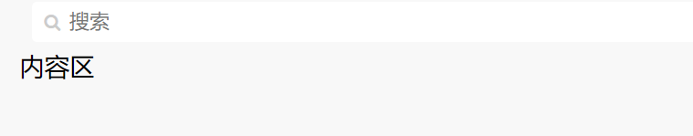

### 2. List 列表组件的设计与开发

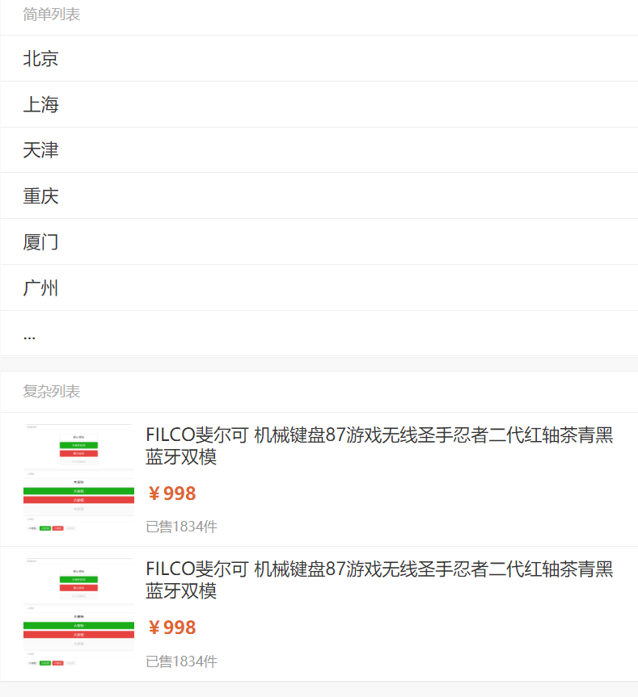

### 3. Grid 网格组件的设计与开发

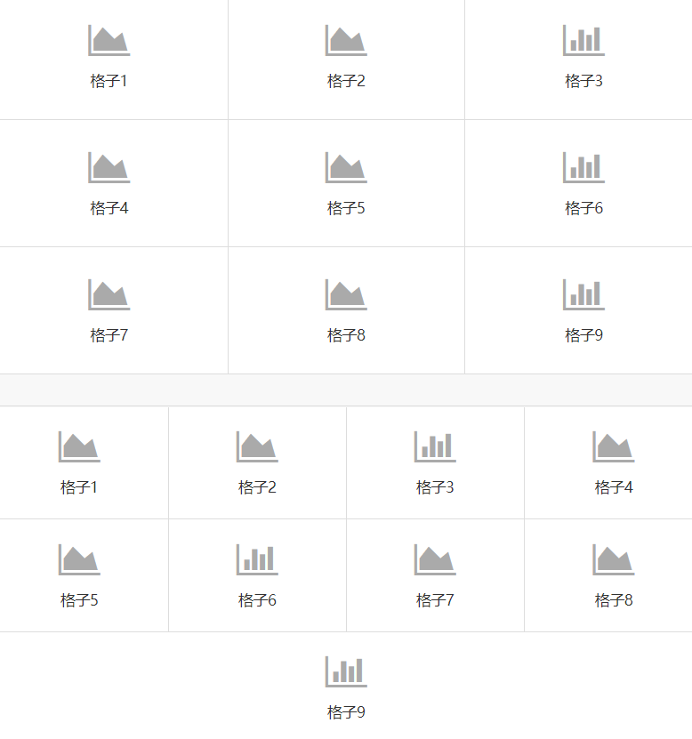

### 4. Menu 菜单样式的设计与开发

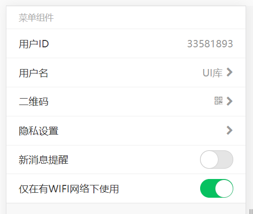

### 5. Modal 模态框样式的设计与开发

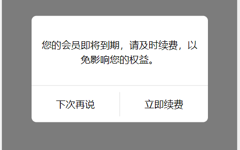
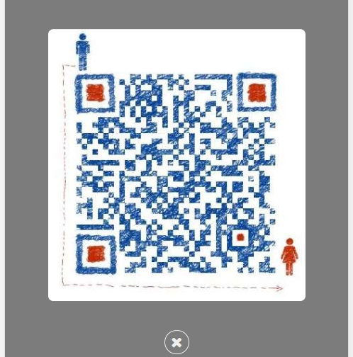

### 6. Loading 加载提示组件的设计与开发

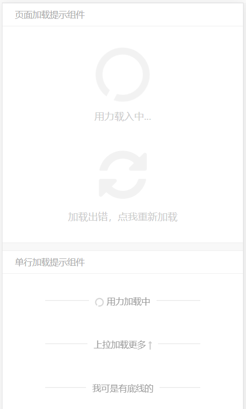

### 7. Toast 提示工具组件的设计与开发

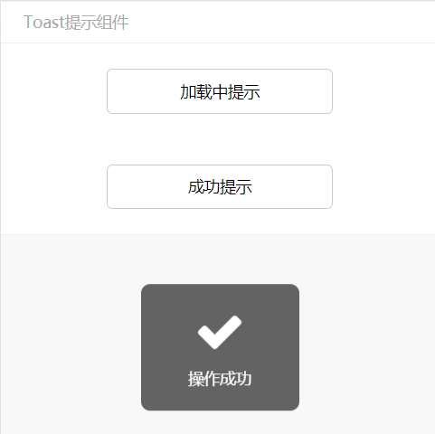
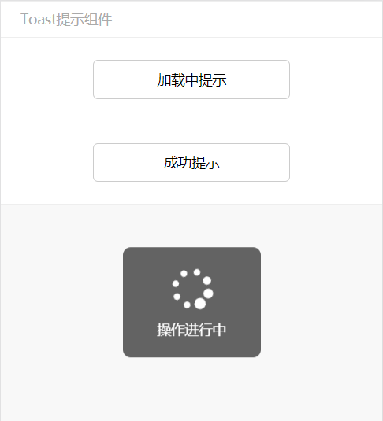

### 8. ActionSheet 选择组件的设计与开发

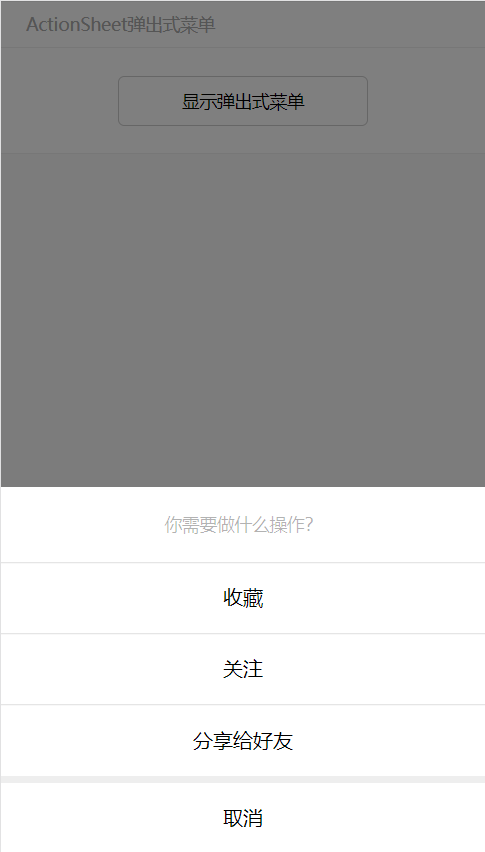

### 9. Article 文本样式的设计与开发

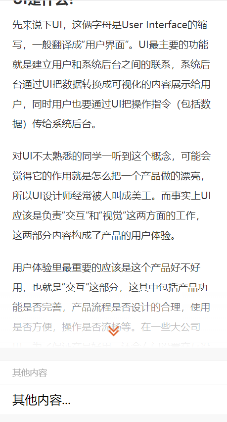

## 效果图

按钮：

图标：
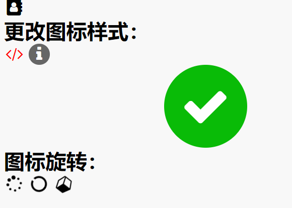
输入框：
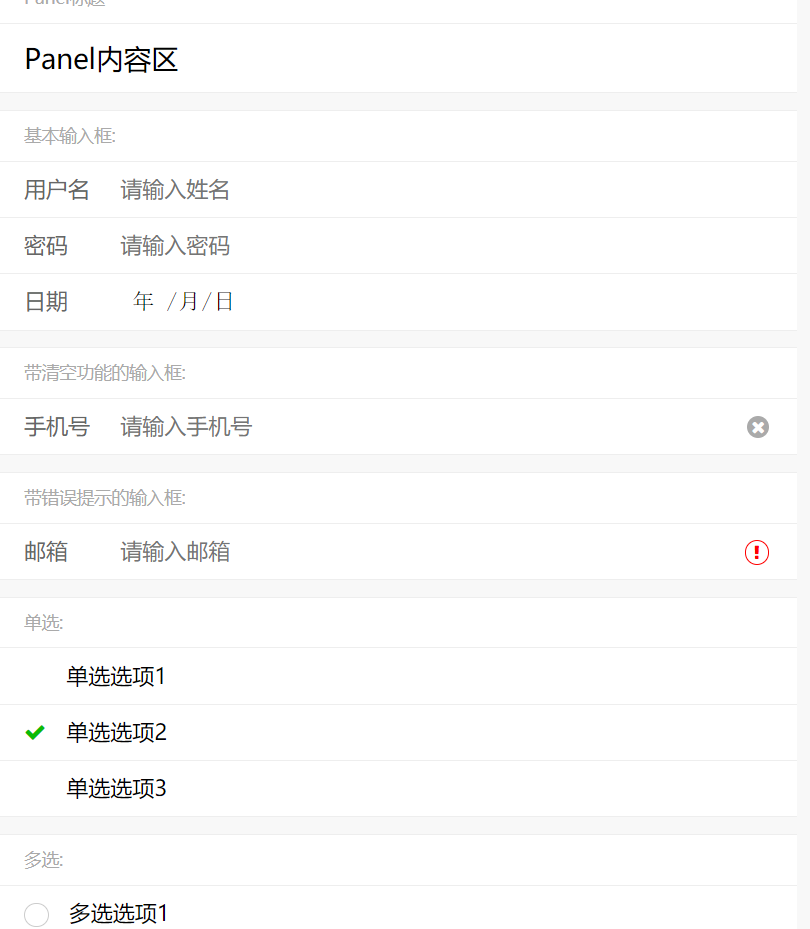
布局：
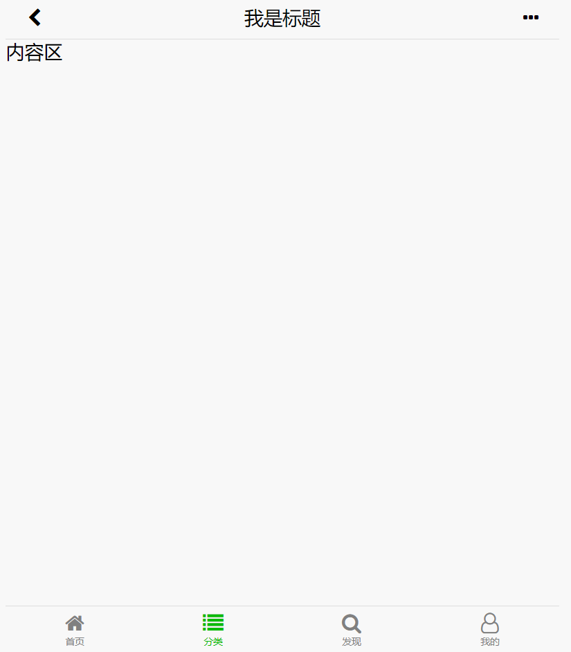
